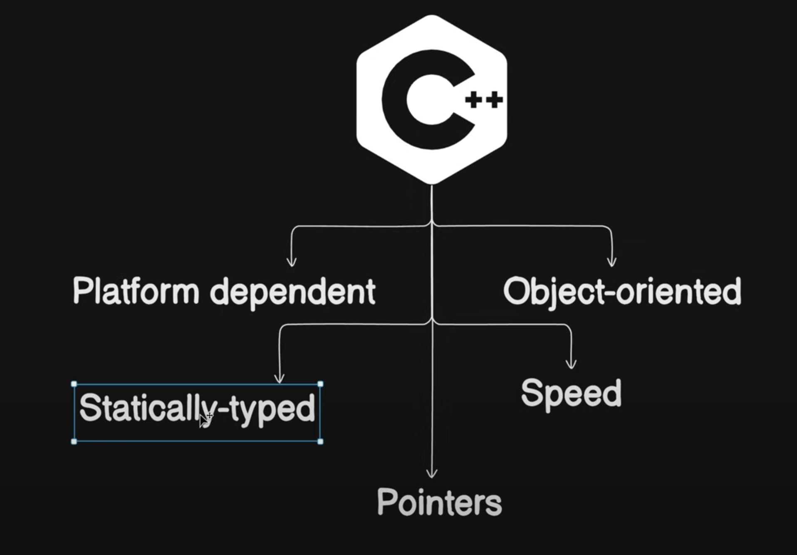
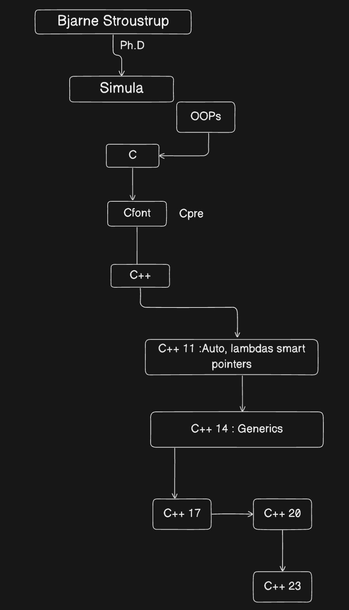

# Chapter 1 : `C++` Course Launch

### `C++` Programming Language :

- `C++` is a programming language that is the foundation of many modern technologies like game engines, web browsers, operating systems financial systems, etc. 

- **Bjarne Stroustrup** developed it as an extension of the C language. 

- `C++` is generally used to create high-performance applications and provides better control of memory and system resources. The latest version of `C++` is `C++` 23 which was released in 2023.

