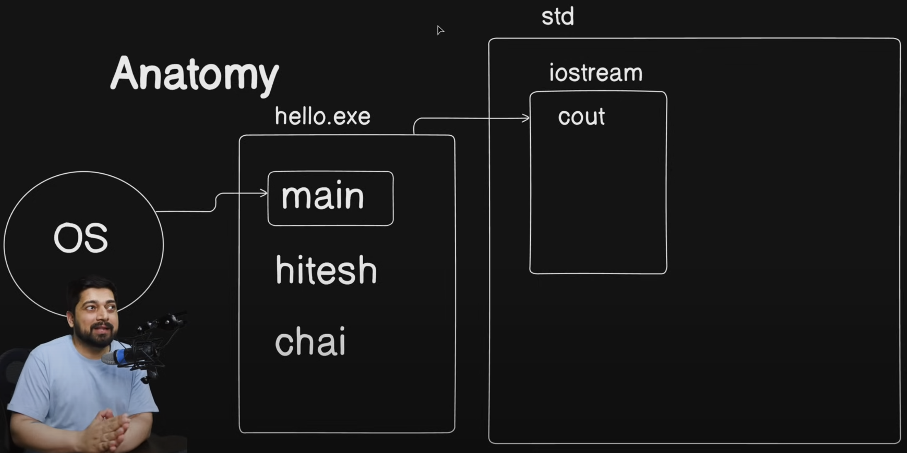

# Going in depth of "Hello World"

### Anatomy

**Pre-processor Directives :** 

- The preprocessor in `C++` is used for processing the code before it is compiled by the compiler. 

- It begins with a '#' symbol and tells the preprocessor to the modify source code before compilation.

- It does many tasks such as including files, conditional compilation, using macros, etc. 

- The preprocessor also allows the developers to select which portions of code should be included or excluded.

- The code processed by the preprocessor is called expanded code and is generally saved with a ".i" file extension.

- There are different preprocessor directives in C++ for different operations. The below table lists frequently used preprocessor directives:
 

<table>
<thead>
    <tr>
        <th>Directive</th>
        <th>Purpose</th>
    </tr>
</thead>

<tbody>
    <tr>
        <td>#include</td>
        <td>Links a header file in the source code.</td>
    </tr>
    <tr>
        <td>#define</td>
        <td>Creates a symbolic or macro constant.</td>
    </tr>
       <tr>
        <td>#undef</td>
        <td>Deletes a macro that has already been defined.<td>
    </tr>
       <tr>
        <td>#ifdef / #ifndef</td>
        <td>Compilation that is conditional on the presence or absence of a macro.</td>
    </tr>
    </tr>
       <tr>
        <td>#if / #elif / #else / #endif</td>
        <td>Compilation that is conditional based on some expression.</td>
    </tr>
    </tr>
       <tr>
        <td>#error</td>
        <td>Halts the compilation process and produces an error notice.</td>
    </tr>
    </tr>
       <tr>
        <td>#warning</td>
        <td>During compilation, a warning notice is shown.</td>
    </tr>
    </tr>
       <tr>
        <td>#pragma</td>
        <td>Provide the compiler specific instructions.</td>
    </tr>
</tbody>
</table>

NOTE : 
- `using namespace std` is written at the beginning to avoid the naming conflict.

- You can also create your own namespace. 