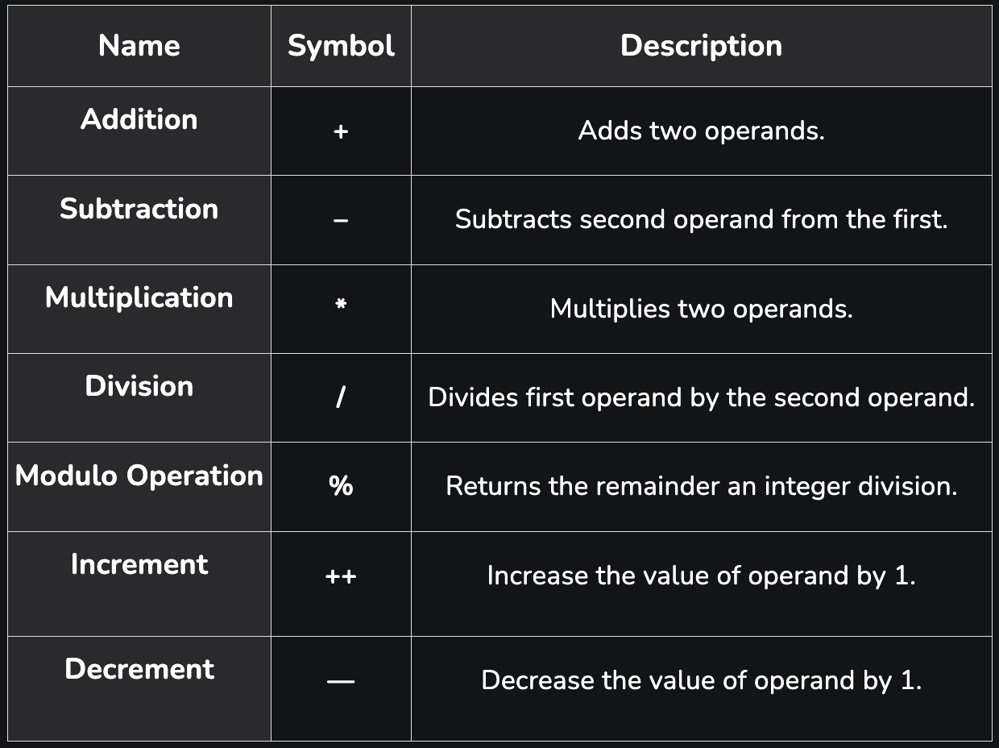
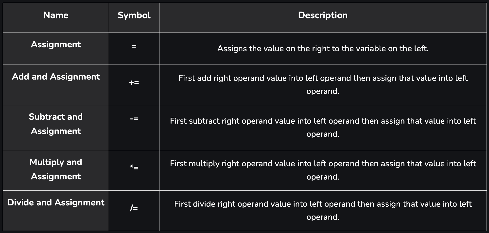
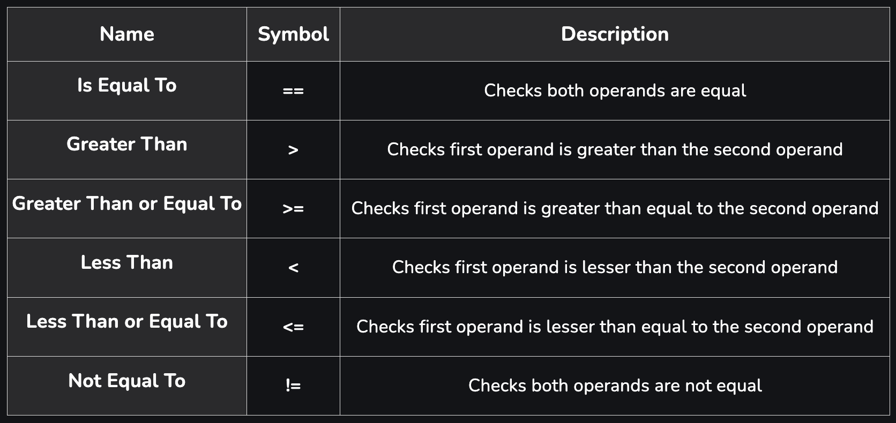
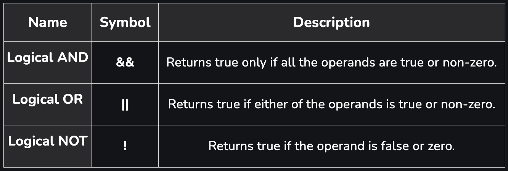
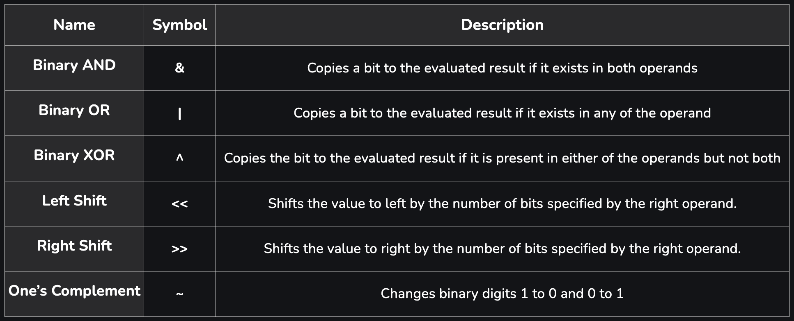

# Operators 

In C++, an operator is a symbol that operates on a value to perform specific mathematical or logical computations on given values. They are the foundation of any programming language.

### 1. Arithmetic Operators : 

- Arithmetic operators are used to perform arithmetic or mathematical operations on the operands. 

- For example, ‘+’ is used for addition.

**Note :** You may have noticed that some operator works on two operands while other work on one. On the basis of this operators are also classified as:

- Unary: Works on single operand.
- Binary: Works on two operands.
- Ternary: Works on three operands.

### 2. Assignment Operators :

- Assignment operators are used to assign value to a variable. 

- We assign the value of right operand into left operand according to which assignment operator we use.  

### 3. Relational Operators :

- Relational operators are used for the comparison of the values of two operands. 

- For example, ‘>’ check right operand is greater.

### 4. Logical Operators :

- Logical operators are used to combine two or more conditions or constraints or to complement the evaluation of the original condition in consideration. 

- The result returns a Boolean value, i.e., true or false.

### 5. Bitwise Operators :

- Bitwise operators are works on bit-level. 

- So, compiler first converted to bit-level and then the calculation is performed on the operands.

