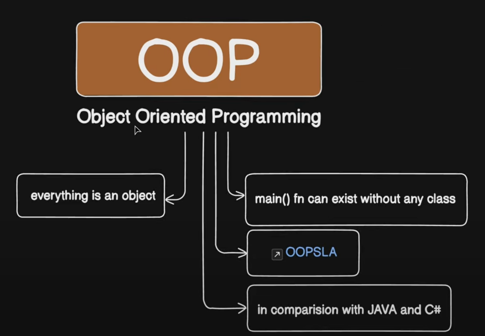

# Object Oriented Programming in C++

- As the name suggests uses objects in programming. 

- Object-oriented programming aims to implement real-world entities like inheritance, hiding, polymorphism, etc. in programming. 

- The main aim of OOP is to bind together the data and the functions that operate on them so that no other part of the code can access this data except that function.



### Class :

- The building block of C++ that leads to Object-Oriented programming is a Class. 

- It is a user-defined data type, which holds its own data members and member functions, which can be accessed and used by creating an instance of that class. 

- A class is like a blueprint for an object. 

- For Example: Consider the Class of Cars. There may be many cars with different names and brands but all of them will share some common properties like all of them will have 4 wheels, Speed Limit, Mileage range, etc. So here, the Car is the class, and wheels, speed limits, and mileage are their properties.

#### Syntax : 

```c++
class ClassName {
    // data members (attributes)

    // Member functions 
}
```

**Note :**

- Attributes : Variables declared inside a class.

- Member functions : A function defined inside a class.

### Object :

- An Object is an identifiable entity with some characteristics and behavior. An Object is an instance of a Class.

- When a class is defined, no memory is allocated but when it is instantiated (i.e. an object is created) memory is allocated.

- Objects take up space in memory and have an associated address like a record in pascal or structure or union. When a program is executed the objects interact by sending messages to one another. 

- Each object contains data and code to manipulate the data. Objects can interact without having to know details of each other’s data or code, it is sufficient to know the type of message accepted and the type of response returned by the objects.

## Access Modifiers :

Access Modifiers or Access Specifiers in a class are used to assign the accessibility to the class members, i.e., they set some restrictions on the class members so that they can’t be directly accessed by the outside functions.

There are 3 types of access modifiers available in C++: 

1. **Public** :

- All the class members declared under the public specifier will be available to everyone. 

- The data members and member functions declared as public can be accessed by other classes and functions too. 

- The public members of a class can be accessed from anywhere in the program using the direct member access operator (.) with the object of that class. 

```c++
// C++ program to demonstrate public
// access modifier

#include<iostream>
using namespace std;

// class definition
class Circle
{
    public: 
        double radius;
        
        double  compute_area()
        {
            return 3.14*radius*radius;
        }
    
};

// main function
int main()
{
    Circle obj;
    
    // accessing public datamember outside class
    obj.radius = 5.5;
    
    cout << "Radius is: " << obj.radius << "\n";
    cout << "Area is: " << obj.compute_area();
    return 0;
}
```

2. **Private** :

- The class members declared as private can be accessed only by the member functions inside the class. They are not allowed to be accessed directly by any object or function outside the class. 

- Only the member functions or the friend functions/ friend class are allowed to access the private data members of the class. 

```c++
// C++ program to demonstrate private
// access modifier

#include<iostream>
using namespace std;

class Circle
{   
    // private data member
    private: 
        double radius;
     
    // public member function    
    public:    
        double  compute_area()
        {   // member function can access private 
            // data member radius
            return 3.14*radius*radius;
        }
    
};

// main function
int main()
{   
    // creating object of the class
    Circle obj;
    
    // trying to access private data member
    // directly outside the class
    obj.radius = 1.5;
    
    cout << "Area is:" << obj.compute_area();
    return 0;
}
```

**Output:**

```c++
 In function 'int main()':
11:16: error: 'double Circle::radius' is private
         double radius;
                ^
31:9: error: within this context
     obj.radius = 1.5;
         ^
```

- The output of the above program is a compile time error because we are not allowed to access the private data members of a class directly from outside the class. 

- Yet an access to obj.radius is attempted, but radius being a private data member, we obtained the above compilation error. 

- However, we can access the private data members of a class indirectly using the public member functions of the class. 

```c++
// C++ program to demonstrate private
// access modifier

#include<iostream>
using namespace std;

class Circle
{   
    // private data member
    private: 
        double radius;
     
    // public member function    
    public:    
        void compute_area(double r)
        {   // member function can access private 
            // data member radius
            radius = r;
            
            double area = 3.14*radius*radius;
            
            cout << "Radius is: " << radius << endl;
            cout << "Area is: " << area;
        }
    
};

// main function
int main()
{   
    // creating object of the class
    Circle obj;
    
    // trying to access private data member
    // directly outside the class
    obj.compute_area(1.5);
    
    
    return 0;
}
```

**Output :**

```c++
Radius is: 1.5
Area is: 7.065
```

3. **Protected** :

- The protected access modifier is similar to the private access modifier in the sense that it can’t be accessed outside of its class unless with the help of a friend class. 

- The difference is that the class members declared as Protected can be accessed by any subclass (derived class) of that class as well. 

```c++
// C++ program to demonstrate
// protected access modifier
#include <bits/stdc++.h>
using namespace std;

// base class
class Parent
{   
    // protected data members
    protected:
    int id_protected;
   
};

// sub class or derived class from public base class
class Child : public Parent
{
    public:
    void setId(int id)
    {
        
        // Child class is able to access the inherited 
        // protected data members of base class
        
        id_protected = id;
        
    }
    
    void displayId()
    {
        cout << "id_protected is: " << id_protected << endl;
    }
};

// main function
int main() {
    
    Child obj1;
    
    // member function of the derived class can
    // access the protected data members of the base class
    
    obj1.setId(81);
    obj1.displayId();
    return 0;
}
```

**Note :** If we do not specify any access modifiers for the members inside the class, then by default the access modifier for the members will be Private. 